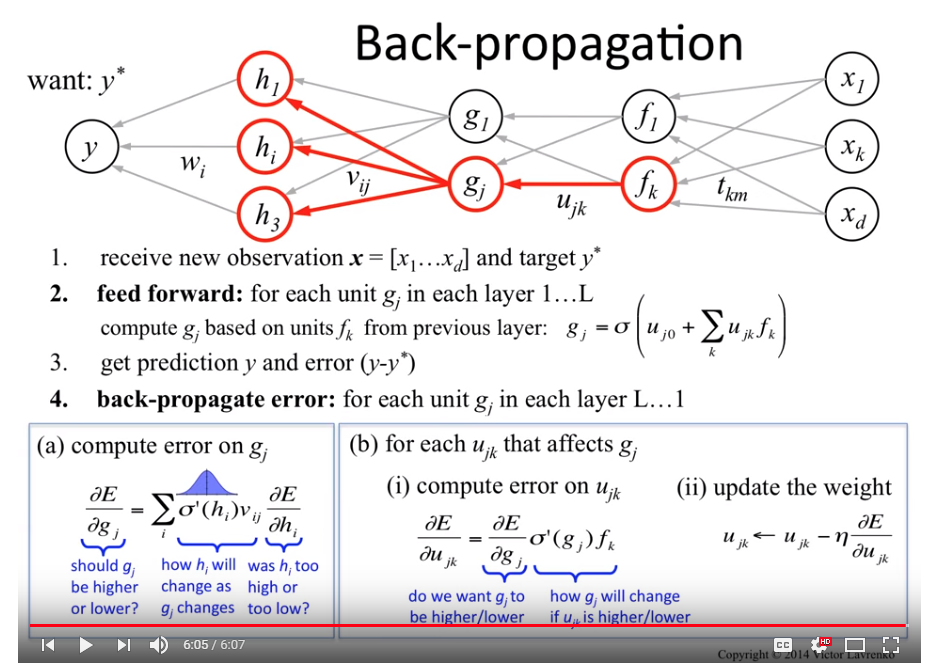
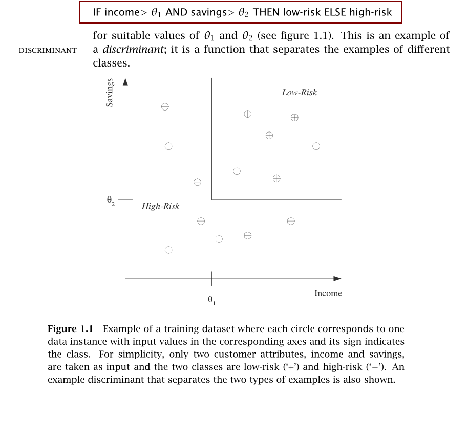

# Ggg.MachineLearning
Machine Learning related notes and code samples. Machine learning is a subset of artificial intelligence in the field of computer science that often uses statistical techniques to give computers the ability to "learn" with data, without being explicitly programmed.

  

  

  

  

  

  

  

  

  

  

  

  

  

  

%20Dimension.PNG)  
